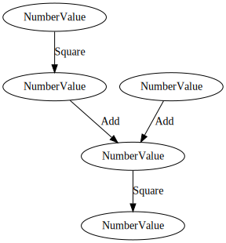

# Depends

[](https://crates.io/crates/depends)
[](https://docs.rs/depends/)
[](https://codecov.io/gh/Justice4Joffrey/depends-rs)
[](https://deps.rs/repo/github/Justice4Joffrey/depends-rs)

A library for ergonomic, performant, incremental computation between
arbitrary types.

## Why would I want that

Most applications rely on some core logic which must respond to external
events. Often, the logic to transform each event in to an action is
straightforward, but as the application scales, many hard to reason-with
situations emerge from the combinatorial explosion of states.

Dependency graphs are an excellent code architecture to tame complexity in
such scenarios.

``` rust
/// A unit of data within a graph.
#[derive(Value, Default, Hash)]
pub struct NumberValue {
    pub value: i32,
}

impl NumberValue {
    pub fn new(value: i32) -> Self {
        Self { value }
    }
}

// By implementing UpdateInput, we can change the value of this node from
// outside of the graph.
impl UpdateInput for NumberValue {
    type Update = i32;

    fn update_mut(&mut self, update: Self::Update) {
        // Implementing this trait will provide a way for code outside of this graph to
        // change its internal state. This is just a simple replace for now.
        self.value = update;
    }
}

/// Any [DerivedNode] must state its dependencies. If there are more than one,
/// this must be wrapped in a struct which derived [Dependencies] as shown.
/// Otherwise, it can be passed to a [DerivedNode] wrapped with the
/// [Dependency] type.
#[derive(Dependencies)]
pub struct TwoNumbers {
    left: NumberValue,
    right: NumberValue,
}

/// We must define the transformation functions for each derived node.
/// Given a set of inputs and a target value, describe how to update the
/// state. In this example, it's just a simple addition.
///
/// Note [TwoNumbersRef] is generated by the [Dependencies] macro, and
/// represents read-references to all of its fields.
pub fn multiply(
    TwoNumbersRef { left, right }: TwoNumbersRef<'_>,
    mut target: RefMut<'_, NodeState<NumberValue>>,
) -> ResolveResult<()> {
    target.value = left.value * right.value;
    Ok(())
}

// Compose a graph!
// Below are input nodes, which are nodes which take new values from
// outside the graph.
let a = InputNode::new(NumberValue::new(7));
let b = InputNode::new(NumberValue::new(6));

// Derived nodes take their value from other nodes (either input or
// derived). Note that we can combine _any_ type of node, not just
// [NumberValue]s.
let c = DerivedNode::new(
    TwoNumbers::init(Rc::clone(&a), Rc::clone(&b)),
    multiply,
    NumberValue::default(),
);

// A visitor tracks which nodes have been visited during a resolve.
let mut visitor = HashSet::<usize>::new();

// Resolve the graph!
// `resolve_root` will clear the visitor before returning, readying it
// for the next resolution.
// This can fail if there are cycles in the graph or an existing read
// reference is being held.
let res = c.resolve_root(&mut visitor).unwrap();
assert_eq!(res.value, 42);

// Nodes which have an edge to dependencies which are updated between
// resolves will recalculate their state on-demand. Others will return
// a cached value. This is known as incremental computation, and can
// vastly improve performance of complex calculations.
a.update(70).unwrap();

// Any dependent values will be updated next time the graph is resolved.
let res = c.resolve_root(&mut visitor).unwrap();
assert_eq!(res.value, 420);
```

Clearly, to implement a simple multiplication problem, a dependency graph is
overkill. However, for more complex problems, where many inputs can change
and the output is a combination of many transformations on that input (and
derivations of it), `depends` can help you produce scalable, performant,
testable code out of the box.


## Graphviz

Any graph built using `depends` can be converted to a [Graphviz](https://graphviz.org/) representation
by passing a `GraphvizVisitor` (this requires the feature `graphviz`).

``` rust 
let mut visitor = GraphvizVisitor::new();
graph.resolve(&mut visitor).unwrap();
assert_eq!(
    graph.render().unwrap(),
    r#"
digraph G {
  2[label="NumberInput"];
  0[label="NumberInput"];
  1[label="NumberInput"];
  0 -> 2;
  1 -> 2;
}
"#);
```

The graph in the above example is rendered below.



## Current Status

This crate should be considered a Proof Of Concept only and treated with huge amounts of scepticism and distrust.

The guarantees we would _like_ to offer, before considering this crate production-worthy are:

- Determinism of output given any sequence of inputs and actions.
- Graphs cannot yield different results between calls to `resolve` without a change in input, other than when `Clean` has been implemented incorrectly.
- Correctness of the internal caching logic.

Feel free to experiment with the crate, apply it to your problems and pass on any feedback you have.

